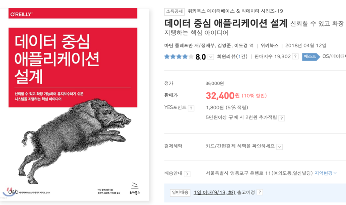
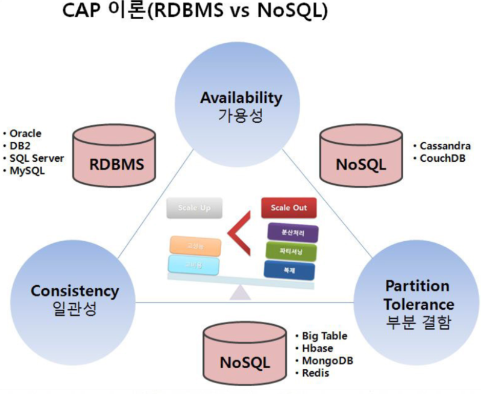

https://lean-mahogany-686.notion.site/07-08-11-00-8ae523170a0140ff8ad21087d7f2af6b
관련 노션링크

빠르게 효율적으로 성장하는 방법 고민하자

https://www.youtube.com/watch?v=MTSn93rNPPE
참고해보면 좋은 영상
https://johngrib.github.io/wiki/pattern/null-object/
Null패턴에 대한 정리 깃헙\
기계인간 블로그

*추천도서*\
데이터중심 애플리케이션 설계\
\
굉장히 추천 트랜잭션 (7장)을 많이 보았음.

https://github.com/JaeKang20/Study/blob/main/src/main/resources/templates/databases/%EB%8D%B0%EC%9D%B4%ED%84%B0%20%EC%A4%91%EC%8B%AC%20%EC%95%A0%ED%94%8C%EB%A6%AC%EC%BC%80%EC%9D%B4%EC%85%98%20%EC%84%A4%EA%B3%84.md

여기에 위 책에대한 핵심 내용들을 정리하였다.

SQL 첫걸음\

### apache-kafka란
데규모 데이터 파이프라인, 이벤트 처리 시스템, 로그 수집 및 분석등에 활용된다.
메시지 큐 시스템으로 작동한다.
## 사전문제 리뷰
초보자는 비관적 락, 낙관적 락까지 알아도 충분하다.
그 이상은 시스템 서비스에 따라 다름

tps가 중요한 시스템에서 비관적 락을 걸면 락 대기시간에 의해 서버가 터짐
비관적 락에 의해 데드락이 발생할 수 있음

비관적 락은 충돌이 발생한다는 가정하에 사용하는 락이기 때문에 실제 충돌이 발생하지 않았는데도 성능을 러프먹고 시작함

사용자수가 100명, 200명 정도고 충돌이 많이 발생하면 비관적 락 사용 추천

레디스 큐로 대기열 만들어서 순차적으로 처리할 수도 있음

tps가 중요하지 않은 시스템인데 고객단위로 정합성을 보장해야됨(정산)

유저아이디 혹은 계좌정보로 분산락을 걸면 정합성 보장됨

레디스나 대기열큐 같은건 굳이 안해도 된다고 생각.

카프카를 이용할 수도 있지만 그닥 추천하진 않음

Redis 사용을 추천함

MSA는 DB가 여러개라 락걸기가 애매함

그래더 레디스로 분산락 거는게 편함

msa에서는 앞단에서 처리하는 분산락을 많이 사용하게 됨

데이터 정합성이 중요한 로직은 2차 방어로직으로 낙관적 락까지 검
 
---------------------------------

## 기술 면접에서 시스템 설계 문제가 가지는 의미
### 1-1)시스템 설계 질문
설계에 정답은 없음 근거(쟝점과 단점)만 잘 제시하면 됨

서비스 사용자수에 따라 아키텍처를 생각하는게 좋다.
오버 엔지니어링은 피하고 상황에 맞게 적재적소로 설계하자

### 1-2) 피해야할것
* 설계의 순수성에 집착한 나머지 타협적 결정을 도외시하고 오버 엔지니어링함.
* 오버에지니어링의 결과로 시스템 전반의 비용이 올라간다.

### 어떤 데이터베이스를 사용하지: RDBMS vs NoSQL
### **가용성** (Availability)

모든 노드가 모든 요청에 대하여 정상적인 응답을 한다.

### 일관성 (Consistecy)

모든 노드가 동일한 데이터를 가지고 있어야한다.

### 부분결함 (Partition Tolerance)

(1) The system continues to operate despite arbitrary message loss or failure of part of the system [[Brewer 의 발표 자료](https://people.eecs.berkeley.edu/~brewer/cs262b-2004/PODC-keynote.pdf)]

(2) The network will be allowed to lose arbitrarily many messages sent from one node to another

[[Gilbert & Lych 정리](https://citeseerx.ist.psu.edu/viewdoc/download?doi=10.1.1.67.6951&rep=rep1&type=pdf)]

⇒ 가용성과 일관성은 분산시스템의 특성이지만 부분결함은 네트워크의 특성

⇒ 하지만 CAP 이론은 세가지 요소가 모두 분산시스템의 특성인 것 처럼 서술한다.

### CAP이론

부분결함은 논란이 많은 내용\
네트워크 장애를 어느정도 수용할 수 있냐\
CAP 이론 자체랑 말이 안맞음(네트워크 부분이 왜있나)\
CAP 이론은 이론중심적\
장애상황, RDB 특성, 클러스터링에 따라 다름

------------------------

*마지막 멘토 팁*

의사소통이 중요하니까 면접관의 의도파악을 재질문 하는것도 좋다.
질문을 통해 확인하자.

힌트를 청하길 주저하지 말자.
