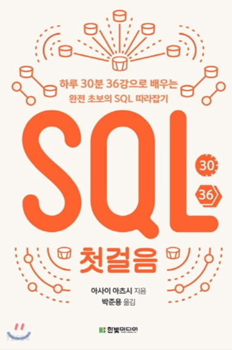

https://lean-mahogany-686.notion.site/07-08-11-00-8ae523170a0140ff8ad21087d7f2af6b
관련 노션링크

빠르게 효율적으로 성장하는 방법 고민하자

https://www.youtube.com/watch?v=MTSn93rNPPE
참고해보면 좋은 영상
https://johngrib.github.io/wiki/pattern/null-object/
Null패턴에 대한 정리 깃헙\
기계인간 블로그

*추천도서*\
데이터중심 애플리케이션 설계\

SQL 첫걸음\

### apache-kafka란
데규모 데이터 파이프라인, 이벤트 처리 시스템, 로그 수집 및 분석등에 활용된다.
메시지 큐 시스템으로 작동한다.

## 기술 면접에서 시스템 설계 문제가 가지는 의미

### 1-2) 피해야할것
* 설계의 순수성에 집착한 나머지 타협적 결정을 도외시하고 오버 엔지니어링함.
* 오버에지니어링의 결과로 시스템 전반의 비용이 올라간다.

### 어떤 데이터베이스를 사용하지: RDBMS vs NoSQL
### **가용성** (Availability)

모든 노드가 모든 요청에 대하여 정상적인 응답을 한다.

### 일관성 (Consistecy)

모든 노드가 동일한 데이터를 가지고 있어야한다.

### 부분결함 (Partition Tolerance)

(1) The system continues to operate despite arbitrary message loss or failure of part of the system [[Brewer 의 발표 자료](https://people.eecs.berkeley.edu/~brewer/cs262b-2004/PODC-keynote.pdf)]

(2) The network will be allowed to lose arbitrarily many messages sent from one node to another

[[Gilbert & Lych 정리](https://citeseerx.ist.psu.edu/viewdoc/download?doi=10.1.1.67.6951&rep=rep1&type=pdf)]

⇒ 가용성과 일관성은 분산시스템의 특성이지만 부분결함은 네트워크의 특성

⇒ 하지만 CAP 이론은 세가지 요소가 모두 분산시스템의 특성인 것 처럼 서술한다.

------------------------

*마지막 멘토 팁*

의사소통이 중요하니까 면접관의 의도파악을 재질문 하는것도 좋다.
질문을 통해 확인하자.

힌트를 청하길 주저하지 말자.
