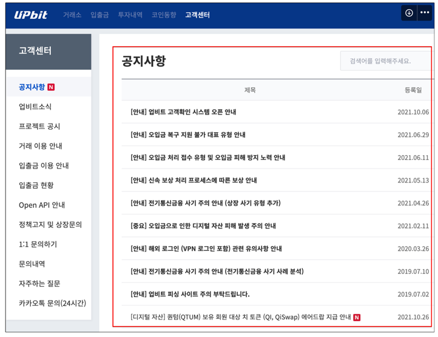
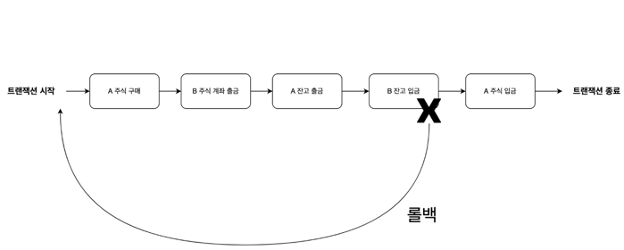

강의 전체 참고링크\
https://lean-mahogany-686.notion.site/2-1-Session-1-f6dd98e30c084d8e95509a903b216ed0

#### 사용자 수에 따른 규모를 확장하는 방법
## 1) 데이터 베이스 다중화 

### **1.1 목적**
대부분의 앱은 읽기 연산의 비중이 쓰기 연산보다 훨씬 높다.
따라서 더 나은 성능을 위하여 데이터 변경은  데이터베이스 서버들로 분산한다.

### 1.2 개념
*분산 프로그램*
- 논리적으로는 하나이지만 물리적으로는 여러가지 데이터베이스를 갖는다.\
참고로 정처기 1과목 분산프로그램에 나오는 개념이다.

### 스프링에서의 사용
**하나의 데이터베이스를 사용할때**
~~~
spring:
datasource:
url: jdbc:mysql://127.0.0.1:3306/kotlin_spring?serverTimezone=UTC
driver-class-name: com.mysql.cj.jdbc.Driver
username: root
password: 1234
~~~

**두개이상의 데이터베이스**
~~~
spring:
  datasource:
    master:
      hikari:
        driver-class-name: com.mysql.cj.jdbc.Driver
        jdbc-url: jdbc:mysql://127.0.0.1:3306/multiple-datesource?serverTimezone=UTC
        read-only: false
        username: root
        password: 1234

    slave:
      hikari:
        driver-class-name: com.mysql.cj.jdbc.Driver
        jdbc-url: jdbc:mysql://127.0.0.1:3306/multiple-datesource?serverTimezone=UTC
        read-only: true
        username: root
        password: 1234
~~~
* yml파일로 추가.

마스터 - 슬레이브로 나누어준다. 슬레이브에서는 read-only.

~~~
@Configuration
public class MasterDataSourceConfig {

    @Primary
    @Bean(name = "masterDataSource")
    @ConfigurationProperties(prefix="spring.datasource.master.hikari")
    public DataSource masterDataSource() {
        return DataSourceBuilder.create()
                .type(HikariDataSource.class)
                .build();
    }

}

@Configuration
public class SlaveDataSourceConfig {

    @Bean(name = "slaveDataSource")
    @ConfigurationProperties(prefix="spring.datasource.slave.hikari")
    public DataSource slaveDataSource() {
        return DataSourceBuilder.create()
                .type(HikariDataSource.class)
                .build();
    }

}
~~~
마스터 슬레이브를 빈등록을 해준다.\
그 다음 스프링의 트랜잭션 readOnly 옵션에 따라 어떤 데이터 소스를 사용할지에 대한 분기 처리가 필요하다.
~~~
public class ReplicationRoutingDataSource extends AbstractRoutingDataSource {

    @Override
    protected Object determineCurrentLookupKey() {
        DataSourceType dataSourceType = TransactionSynchronizationManager
          .isCurrentTransactionReadOnly() ? DataSourceType.Slave : DataSourceType.Master;
          
        return dataSourceType;
    }
}

public enum DataSourceType {
    Master, Slave
}
~~~
더 자세히 설정을 해야한다. 자세한 링크는\
https://cheese10yun.github.io/spring-transaction/ 
\
http://webcache.googleusercontent.com/search?q=cache:Lw-c3SLW8LEJ:kwon37xi.egloos.com/5364167&cd=11&hl=ko&ct=clnk&gl=kr\ \
레플리카 참고 영상\
https://www.youtube.com/watch?v=95bnLnIxyWI
\

## 2) 캐시
값비싼 연산 결과 또는 자주 참조되는 데이터를 메모리 안에 두고 사용하도록 하는 저장소이다.

캐시의 장점은 데이터베이스에 직접 조회하는 것 보다 성능이 좋을 뿐만 아니라 데이터베이스 부하를 부하를 줄일 수 있다.

만약 아래 그림 처럼 공지사항과 같은 동일한 결과를 반본적으로 돌려주는 API 가 있다고 생각하자.

이 API는 요청을 받으면 매번 Controller --> Service --> Repository 를 거친다음 DB 조회 및 로직을 처리하는 과정을 반복적으로 진행한다.

즉, 동일한 결과를 보여주는 작업을 반복적으로 진행하기 때문에 비효율적이다.

\

### **장점**

- 네트워크 호출 x, 서버의 물리 메모리에 직접 접근하기 때문에 빠르다.

### **단점**

- 서버가 여러대인 경우 동기화 문제가 있다.
- 인스턴스 물리 메모리 사이즈 제약이 있다.
- 
## 3) CDN
정적 콘텐츠를 전송하는 데 쓰이는 분산된 서버

## 4) 트랜잭션
애플리케이션에서 몇 개의 읽기와 쓰기를 하나의 논리적 단위로 묶는 방법
\
개념적으로 한 트랜잭션 내의 모든 읽기와 쓰기는 한 연산으로 실행된다.

트랜잭션은 전체가 성공(Commit) 하거나 실패(RollBack)한다.

현실에서 시스템은 아래와 같은 상항을 마주칠 수 있다.

- 시스템은 쓰기 연산이 실행 중일 때를 포함해서 언제라도 실패할 수 있다.
- 시스템은 언제든지 죽을 수 있다.
- 시스템은 언제든지 네트워크 단절이 발생할 수 있다.
- 여러 클라이언트가 동시에 데이터베이스에 쓰기 연산을 수행하여 데이터를 덮어쓸 수 있다.
- 부분적으로 갱신된 비정상적인 데이터를 읽을 수 있다.
- 클라이언트끼리 경합이 발생하여 예상치 못한 동작을 할 수 있다.
### **4.2 ACID 의 의미**

트랜잭션이 보장하는 안전성 보장은 원자성(Atiomicity), 일관성(Consistency), 격리성(Isolation), 지속성(Durability)을 의미하는 약어인 ACID 로 잘 알려져 있다.

사실 ACID 라는 용어는 매우 모호하다. ACID 를 준수하는 시스템이라고 할 때 그 시스템에서 실제로 어떤 것을 기대할 수 있는지 분명하지 않다.

예를들어 격리성 같은 경우 어떠한 종류의 격리성을 사용하는지에 따라 시스템이 동작하는 방식이 다르기 때문이다.

원자성, 격리성, 지속성은 데이터베이스의 속성인 반면에, 일관성은 애플리케이션 속성이다. 자세한 내용은 아래에서 더 살펴보자.

[원자성]

- 원자적이란 ? 더 작은 부분으로 쪼갤 수 없는 의미를 가진다.
- 멀티쓰레드 프로그래밍에서는 A쓰레드에서 원자적 연산을 수행한다면, B쓰레드에서는 중간에 알 수 없다.
- 즉, 시스템은 연산을 실행하기 전/후 상태만 있을 수 있고 중간 상태는 있을 수 없다.

이 개념은 트랜잭션에 적용한다면, 하나의 트랜잭션이 원자성을 보장한다는 의미는 Commit 혹은 Rollback 만이 존재한다는 것이다.

Rollback의 원인은 비즈니스 로직 실패, 네트워크 단절 등의 이슈로 발생할 수 있다.

정리하자면, 트랜잭션을 Rollback 하고 기록한 모든 내용을 되돌리는 기능은 ACID 의 원자성의 특징이다.

[일관성]

일관성은 데이터 불변식을 보장하는 것을 의미한다.

예를들어 회계 시스템에서 모든 계좌에 걸친 대변과 차변은 항상 맞아 떨어져야한다.

하지만, 일관성을 유지하도록 트랜잭션을 정의하는 것을 애플리케이션의 책임이다.

데이터베이스는 불변식을 위반하는 잘못된 데이터를 쓰지 못하도록 막을 수 없다. (사용할 수 있는 방법은 외래 키 제약 조건 혹은 유일 성 제약 조건 뿐이다.)

일반적으로 애플리케이션에서 데이터가 유효한지 아닌지를 정의하고 데이터베이스는 단순히 데이터를 저장할 뿐이다.

-------------------------------
## **내가 면접을 준비 했던 방법**

### → **1. 이력서를 잘 쓰자**

### → **2. 기본 개념은 확실히 하자**

**(할 수 있다면 스터디 그룹을, OKKY, 자바 카페, 남궁성님 카페, 블라인드)**

### → **3. 내가 이걸 왜 했는지 ???**

### **좋은 포폴 참고용**
https://github.com/woowacourse-teams/2020-6rinkers

## 이력서 잘 쓴거
https://drive.google.com/file/d/1C_ACIAPAk8angUm8HFTovvFx98s-z1Js/view
\
칸바 이용해서 써보자