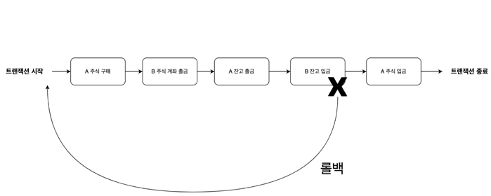

강의 전체 참고링크\
https://lean-mahogany-686.notion.site/2-1-Session-1-f6dd98e30c084d8e95509a903b216ed0

#### 사용자 수에 따른 규모를 확장하는 방법
## 1) 데이터 베이스 다중화 

### **1.1 목적**
대부분의 앱은 읽기 연산의 비중이 쓰기 연산보다 훨씬 높다.
따라서 더 나은 성능을 위하여 데이터 변경은  데이터베이스 서버들로 분산한다.

### 1.2 개념
*분산 프로그램*
- 논리적으로는 하나이지만 물리적으로는 여러가지 데이터베이스를 갖는다.\
참고로 정처기 1과목 분산프로그램에 나오는 개념이다.

### 스프링에서의 사용
**하나의 데이터베이스를 사용할때**
~~~
spring:
datasource:
url: jdbc:mysql://127.0.0.1:3306/kotlin_spring?serverTimezone=UTC
driver-class-name: com.mysql.cj.jdbc.Driver
username: root
password: 1234
~~~

**두개이상의 데이터베이스**
~~~
spring:
  datasource:
    master:
      hikari:
        driver-class-name: com.mysql.cj.jdbc.Driver
        jdbc-url: jdbc:mysql://127.0.0.1:3306/multiple-datesource?serverTimezone=UTC
        read-only: false
        username: root
        password: 1234

    slave:
      hikari:
        driver-class-name: com.mysql.cj.jdbc.Driver
        jdbc-url: jdbc:mysql://127.0.0.1:3306/multiple-datesource?serverTimezone=UTC
        read-only: true
        username: root
        password: 1234
~~~
* yml파일로 추가.

마스터 - 슬레이브로 나누어준다. 슬레이브에서는 read-only.

~~~
@Configuration
public class MasterDataSourceConfig {

    @Primary
    @Bean(name = "masterDataSource")
    @ConfigurationProperties(prefix="spring.datasource.master.hikari")
    public DataSource masterDataSource() {
        return DataSourceBuilder.create()
                .type(HikariDataSource.class)
                .build();
    }

}

@Configuration
public class SlaveDataSourceConfig {

    @Bean(name = "slaveDataSource")
    @ConfigurationProperties(prefix="spring.datasource.slave.hikari")
    public DataSource slaveDataSource() {
        return DataSourceBuilder.create()
                .type(HikariDataSource.class)
                .build();
    }

}
~~~
마스터 슬레이브를 빈등록을 해준다.\
그 다음 스프링의 트랜잭션 readOnly 옵션에 따라 어떤 데이터 소스를 사용할지에 대한 분기 처리가 필요하다.
~~~
public class ReplicationRoutingDataSource extends AbstractRoutingDataSource {

    @Override
    protected Object determineCurrentLookupKey() {
        DataSourceType dataSourceType = TransactionSynchronizationManager
          .isCurrentTransactionReadOnly() ? DataSourceType.Slave : DataSourceType.Master;
          
        return dataSourceType;
    }
}

public enum DataSourceType {
    Master, Slave
}
~~~
더 자세히 설정을 해야한다. 자세한 링크는\
https://cheese10yun.github.io/spring-transaction/ 
\
http://webcache.googleusercontent.com/search?q=cache:Lw-c3SLW8LEJ:kwon37xi.egloos.com/5364167&cd=11&hl=ko&ct=clnk&gl=kr\ \
레플리카 참고 영상\
https://www.youtube.com/watch?v=95bnLnIxyWI
\

## 2) 캐시
값비싼 연산 결과 또는 자주 참조되는 데이터를 메모리 안에 두고 사용하도록 하는 저장소이다.

캐시의 장점은 데이터베이스에 직접 조회하는 것 보다 성능이 좋을 뿐만 아니라 데이터베이스 부하를 부하를 줄일 수 있다.
## 3) CDN
정적 콘텐츠를 전송하는 데 쓰이는 분산된 서버

## 4) 트랜잭션
애플리케이션에서 몇 개의 읽기와 쓰기를 하나의 논리적 단위로 묶는 방법

개념적으로 한 트랜잭션 내의 모든 읽기와 쓰기는 한 연산으로 실행된다.

트랜잭션은 전체가 성공(Commit) 하거나 실패(RollBack)한다.

현실에서 시스템은 아래와 같은 상항을 마주칠 수 있다.

- 시스템은 쓰기 연산이 실행 중일 때를 포함해서 언제라도 실패할 수 있다.
- 시스템은 언제든지 죽을 수 있다.
- 시스템은 언제든지 네트워크 단절이 발생할 수 있다.
- 여러 클라이언트가 동시에 데이터베이스에 쓰기 연산을 수행하여 데이터를 덮어쓸 수 있다.
- 부분적으로 갱신된 비정상적인 데이터를 읽을 수 있다.
- 클라이언트끼리 경합이 발생하여 예상치 못한 동작을 할 수 있다.

## **내가 면접을 준비 했던 방법**

### → **1. 이력서를 잘 쓰자**

### → **2. 기본 개념은 확실히 하자**

**(할 수 있다면 스터디 그룹을, OKKY, 자바 카페, 남궁성님 카페, 블라인드)**

### → **3. 내가 이걸 왜 했는지 ???**

### **좋은 포폴 참고용**
https://github.com/woowacourse-teams/2020-6rinkers
