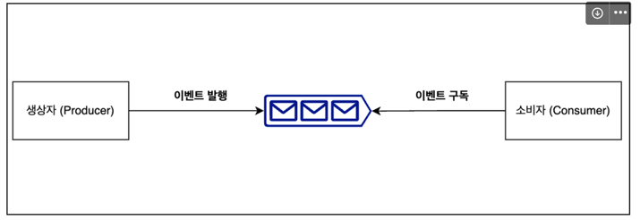

# ****사용자 수에 따른 규모를 확장하는 방법 - 2 편****

## **1) 메시지 큐**

### **1.1 메시지 큐 ??**
\
메시지 큐란 외부에 있는 큐라고 생각하면 편합니다.

메시지 큐에 일단 보관된 메시지는 소비자(consumer) 가 꺼낼 때까지 안전히 보관된다는 특성을 보장하는 비동기 통신 매체이다.

### **1.2 장점 ?**

메시지 큐를 사용하면 서비스 또는 서버 간 결합이 느슨해져서, 규모 확장성이 보장되어야 하는 인정적 애플리케이션을 구성할 수 있다.

생산자(producer) 는 소비자(consumer) 프로세스가 다운되어도 메시지를 발행할 수 있고, 그 반대도 가능하다.

### **1.3 사용 사례 ?**

알림 푸쉬 발송, 이메일 발송, 이미지 보정 등 시간이 오래 걸릴 수 있는 프로세스를 비동기적으로 처리한다.

\
다음은, 회사에서 최근에 많이 쓰이는 이벤트 큐(Kafka)에 대해 알아보겠다.

### **1.4 이벤트 큐**

메시지 큐와 달리 한 번 읽은 데이터가 즉시 삭제 되지 않는다.\
*지속성 보장*

현대 애플리케이션에서는 이벤트 기반 마이크로서비스 아키텍처를 구현하는데 많이 활용된다.

[특징]

- 단일 진실 공급원
- 장애가 일어난 시점부터 재처리가 가능하다.
- 많은 양의 실시간 데이터를 효율적으로 처리가 가능

# [참고링크](https://www.youtube.com/watch?v=H_DaPyUOeTo&ab_channel=%EB%8D%B0%EB%B8%8C%EC%9B%90%EC%98%81DVWY)

