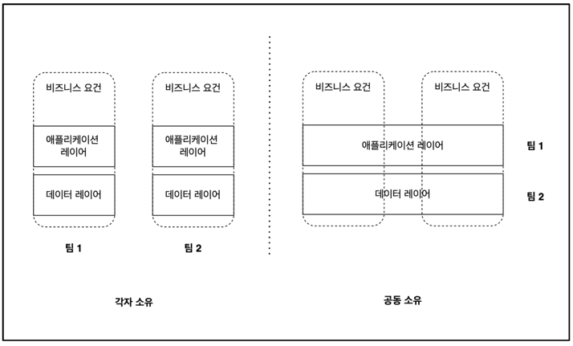
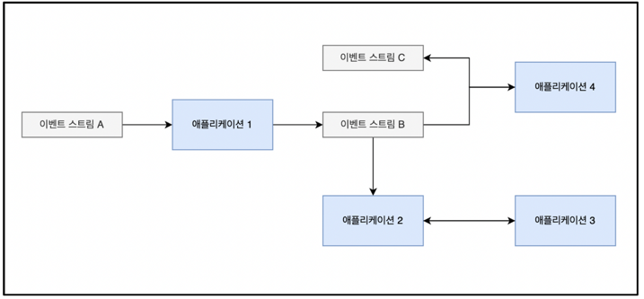

## **2) 이벤트 기반 마이크로서비스**

### **2.1 이벤트 기반 마이크로서비스 ??**

\

- 현대 Event Driven MSA 에서는 시스템 이벤트를 생성/소비하는 방식으로 서로 통신한다.
- 이벤트를 소비해도 전달한 시스템에서 바로 사라지지 않고 다른 컨슈머도 가져갈 수 있게 보존된다.

### **2.2 DDD 와 Bounded context**

- Bounded context 를 비즈니스 중심으로 설계하면 팀별로 느슨하게 결합하며 고도로 응집된 MSA 를 할 수 있다.(단점: 오히려 관리가 어려워지는 부분이 있어\
다시 모놀리스로 돌아간 케이스도 있었다고 한다.[참고영상](https://www.youtube.com/watch?v=uTSuVFyv81w&ab_channel=WorkerKSUG)
- 덕분에 비즈니스에 필요한 솔루션을 자율적으로 설계/구현 다능 (Polyglot)
- 팀 간의 복잡한 의존 관계가 줄어든다.
- 만약에 기술 중심으로 설계하면 모놀리식 시스템과 같은 문제를 겪게 된다.

### **2.3 이벤트 기반 통신 구조**

- 요청과 응답 API 에 얽매이는 일 없이 이벤트 스트림 내부에 정의된 이벤트 데이터를 매개로 소통한다.
- Producer 는 자신이 맡은 이벤트 스트림에 잘 정의된 데이터를 생상하는 일만 책임지면 된다.
- Consumer 는 이벤트 스트림에서 들어온 데이터를 처리하는 일을 담당한다.
- 느슨한 결합과 높은 응집도를 추구하는 Bounded context 원칙을 더 확실히 준수할 수 있다.

### **2.4 동기식 마이크로서비스의 문제점 [[참고 영상](https://www.youtube.com/watch?v=J-VP0WFEQsY&ab_channel=naverd2)]**

- (1) 점대점 결합: 다른 서비스에 의존한다.
- (2) 의존적 확장: 의존하는 다른 모든 서비스가 확장이 가능한지 고려해야한다.
- (3) API 버저닝: API 스펙을 변경하는건 매우 어렵다.
- (4) 테스트: 의존하는 서비스까지 통합해서 테스트하기 어렵다.

## [⭐신입이 참고 해볼법만한 프로젝트](https://github.com/f-lab-edu/graduate-resume)

### 2.5 비즈니스 토폴로지

- 비즈니스 토포롤지: ( 마이크로서비스 + 이벤트 스트림 + API ) 집합이다.
- 마이크로서비스는 비즈니스 Bounded context 를 구현한다.
- 이벤트 스트림은 전체 context 의 도메인 데이터를 공유하기 위해 필요한 데이터 통신 수단이다.