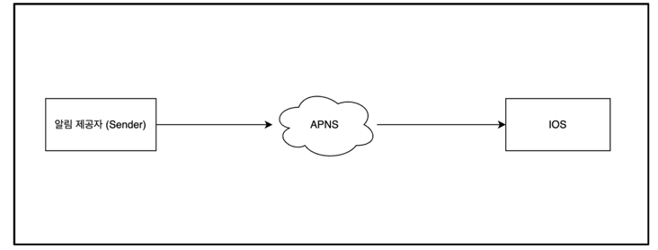
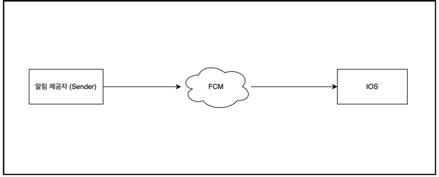
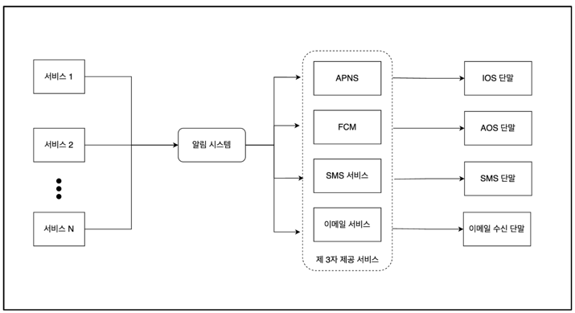
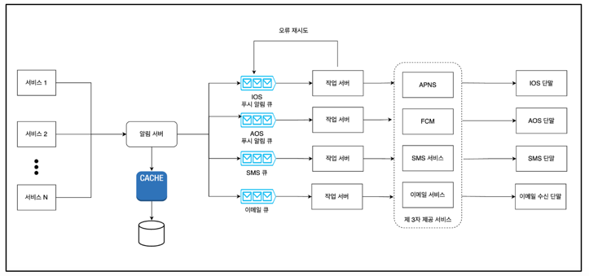

# **앞에서 배운 내용을 예제에 적용하자**

## **1) 알림 시스템 설계**

### **1.1 개요**

알림 시스템은 많은 서비스에서 최신 뉴스, 제품 업데이트, 이벤트 등 비즈니스적으로 중요한 내용들을 비동기적으로 제공한다. 이 시스템은 모바일 푸쉬 알림, SMS 메시지 그리고 이메일 세 가지로 분류할 수 있다.

### **1.2 대략적 설계**

### **(1) IOS**

- 알림 제공자(provider): 알림 요청을 만들어 애플 푸시 알림 서비스로 보내주는 주체. 알림 요청을 보내려면 device token, payload 데이터가 필요하다.
- 알림 서비스(APNS): 애플에서 제공하는 원격 서비스다. 푸시 알림을 iOS 장치로 보내는 역할을 담당한다

### **(2) AOS**

- 알림을 보내려면 모바일 단말 토큰, 전화번호, 이메일 주소 등의 정보가 필요하다.
- 즉, 앱을 설치한 후에 처음 계정에 가입할 때 해당 사용자의 정보를 데이터베이스에 저장한다.

### **(5) [초안] 개략적 설계**

N 개의 서비스

- 이 서비스 각각은 마이크로서비스일수도 있고, 크론잡일 수도 있고, 분산 시스템 컴포넌트일 수도 있다.

알림 시스템

- 알림 시스템은 알림 전송/수신 처리의 핵심이다.
- 시스템은 서비스 1~N에 알림 전송을 위한 API를 제공해야 하고, 제 3자 서비스에 전달할 알림 페이로드를 만들어 낼 수 있어야 한다.

제 3자 서비스 (third party services)

- 이 서비스들은 사용자에게 알림을 실제로 전달하는 역할을 한다.
- 해당 서비스는 확장성이 중요하다. 쉽게 새로운 서비스를 통합하거나 기존 서비스를 제거할 수 있어야 한다는 뜻이다.

[문제점]

SPOF (Single Point Of Faliure)

- 알림 서비스에 서버가 하나밖에 없다는 것은, 그 서버에 장애가 생기면 전체 서비스의 장애로 이어진다.

규모 확장성

- 한 대 서비스로 푸시 알림에 관계된 모든 것을 처리하므로, 데이터베이스나 캐시 등 중요 컴포넌트의 규모를 개별적으로 늘리기 어렵다.

### **(6) [최종] 개략적 설계**
