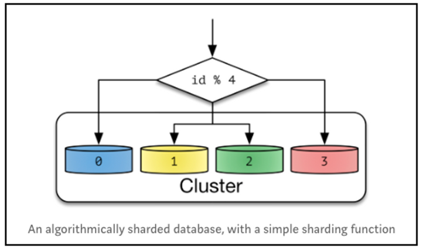
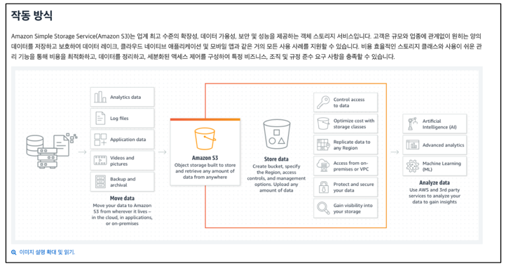

## **2) 구글 드라이브 설계**

### **2.1 요구 사항**

- (1) 파일 추가
- (2) 파일 다운로드
- (3) 여러 단말에 파일 동기화
- (4) 파일 갱신 이력 조회
- (5) 파일 공유
- (6) 파일 편집 & 삭제 알림 표시

### **2.2 구현해야 할 API**

(1) 파일 업로드 API

- 단순 업로드: 파일 크기가 작을 때 사용한다.
- 이어 올리기: 파일 크기가 크거나 네트워크 단절이 생길 경우 사용한다.

(2) 파일 다운로드 API

- ex) POST https://api.example.com/files/download --data '{"path" : "/recipes/soup/best_soup.txt"}'

### **2.3 한 대 서버 제약 극복**

만약 파일시스템 여유 공간이 없다면 ?? -> 데이터를 샤딩하여 여러 서버에 나누어 저장할 수 있다.

하지만, 여유 공간이 없을 때마다 매번 샤딩을 하는 것은 번거로운 작업이다.

이럴땐 이미 알려진 서비스를 사용하는 것도 좋은 방법이다.

아마존 S3 를 사용하면 업계 최고 수준의 규모 확장성, 가용성, 보안 성능을 모두 제공받을 수 있다.

### **2.4 좀 더 고민할 수 있는 부분들**

### **(1) 로드밸런서**

- 네트워크 트래픽을 분산하기 위해 사용한다.
- 로드밸런서는 트래픽을 고르게 분산할 뿐 아니라 장애가 발생하면 자동으로 해당 서버를 우회해준다.

### **(2) 웹 서버**

- 로드밸런서를 추가하고 나면 더 많은 웹서버를 쉽게 추가할 수 있다.
- 따라서 트래픽이 증가해도 쉽게 대응이 가능하다.

### **(3) 메타데이터 데이터베이스**

- 데이터베이스 파일 저장 서버에서 분리하여 SPOF(single point of failure) 를 회피한다.
- 사용자 이름, 파일 이름, 업로드 날짜

### **(4) 파일 저장소**

- S3 파일 저장소로 사용하고 가용성과 데이터 무손실을 보장하기 위해 두 개 이상의 지역에 데이터를 다중화한다.

