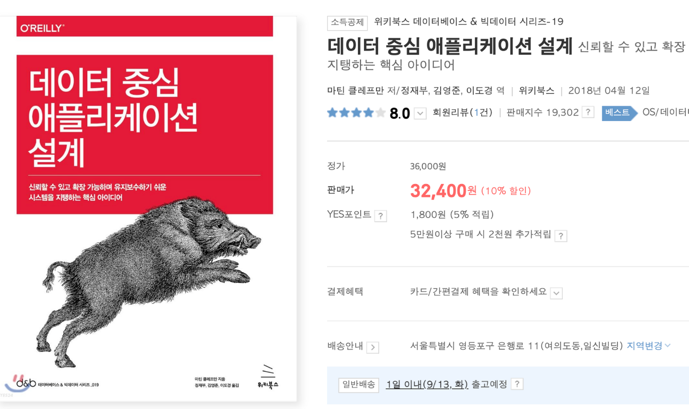

# 아하!모먼트

# → 주제: **내가 신입 때 공부 했던 주제**

→ (1) 스프링 공식 문서 (다른 프레임워크 장고, 레일즈 기타 등등)

→ (2) *이펙티브 자바* (다른 언어도 비슷한 책) + 객체 지향도 병행하면 좋음

→ (3) SQL 튜닝 공부 → Real MySQL 병행

→ (4) 만들면서 배우는 클린아키텍처

→ (5) 가상면접사례 대규모 시스템 설계

→ (6) 데이터 중심 애플리케이션 설계

### [자바공부할때 좋은영상](https://www.youtube.com/watch?v=dJ5C4qRqAgA)
### [서버트래픽 좋은영상2](https://www.youtube.com/watch?v=MTSn93rNPPE)

30개월 정도 개발 한 것 같고

24개월 되기 전까지 1~5까지는 다 본 것 같아요